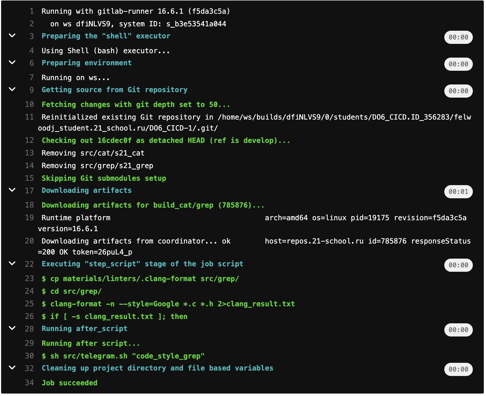

# D06_CI-CD
---
## Part 1. Настройка gitlab-runner

### Поднять виртуальную машину Ubuntu Server 20.04 LTS

---
### Скачать и установить на виртуальную машину gitlab-runner

Устанавливал по инструкции из Gitlab  https://docs.gitlab.com/runner/install/linux-manually.html

---
## Part 2. Сборка

### Написать этап для CI по сборке приложений из проекта C2_SimpleBashUtils:
### В файле gitlab-ci.yml добавить этап запуска сборки через мейк файл из проекта C2
### Файлы, полученные после сборки (артефакты), сохранять в произвольную директорию со сроком хранения 30 дней.
---
- Создаем файл .gitlab-ci.yml в корне проекта и вписываем стадию build

- Результат сборки

---

## Part 3.  Тест кодстайла

### Написать этап для CI, который запускает скрипт кодстайла (clang-format):
### Если кодстайл не прошел, то "зафейлить" пайплайн
### В пайплайне отобразить вывод утилиты clang-format
---
- Дописываем стадию кодстайла

- Результат сборки

---

---

## Part 4. Интеграционные тесты

### Написать этап для CI, который запускает ваши интеграционные тесты из того же проекта:
### Запускать этот этап автоматически только при условии, если сборка и тест кодстайла прошли успешно
### Если тесты не прошли, то "зафейлить" пайплайн
### В пайплайне отобразить вывод, что интеграционные тесты успешно прошли / провалились
---

- Дописываем стадию интеграционных тестов

- Результат сборки

---

---

## Part 5. Этап деплоя

- Поднять вторую виртуальную машину Ubuntu Server 20.04 LTS

- Соединяем две машины при помощи netplana, для этого:
    1) Подключаем сетевой интерфейс в каждой машине(внутренняя сеть)
    2) В конфигах netplana прописываем пути до каждой из машин
    3) Пингуем их между собой, проверяя что связь появилась

---

---
### Написать этап для CD, который "разворачивает" проект на другой виртуальной машине:
### Запускать этот этап вручную при условии, что все предыдущие этапы прошли успешно

- Дописываем стадию деплоя

---
- Написать bash-скрипт, который при помощи ssh и scp копирует файлы, полученные после сборки (артефакты), в директорию /usr/local/bin второй виртуальной машины

В скрипте помимо ssh и scp испольузются expect,spawn и send
1) spawn - запускает какой то процесс или программу
2) expect - ожидание данных, выводимых программой
3) send - отправка ответа, похожа на echo

- Результат сборки

- Сохранить дампы

---

## Part 6. Уведомления

### Настроить уведомления о успешном/неуспешном выполнении пайплайна через бота с именем "[ваш nickname] DO6 CI/CD" в Telegram

- Создаем telegram-бота с помощью @BotFather

- Получаем токен бота и используем его в нашем скрипте из materials/notification.md

- Добавляем идентификатор профиля telegram и job_status ($CI_JOB_STATUS) в скрипт

- После каждой стадии прописываем запуск скрипта telegram.sh в файле .gitlab-ci.yml

- Скрипт присылает уведомления об успешном/неуспешном выполнении пайплайна через бота с именем "felwoodj_DO6_CI/CD" в Telegram

